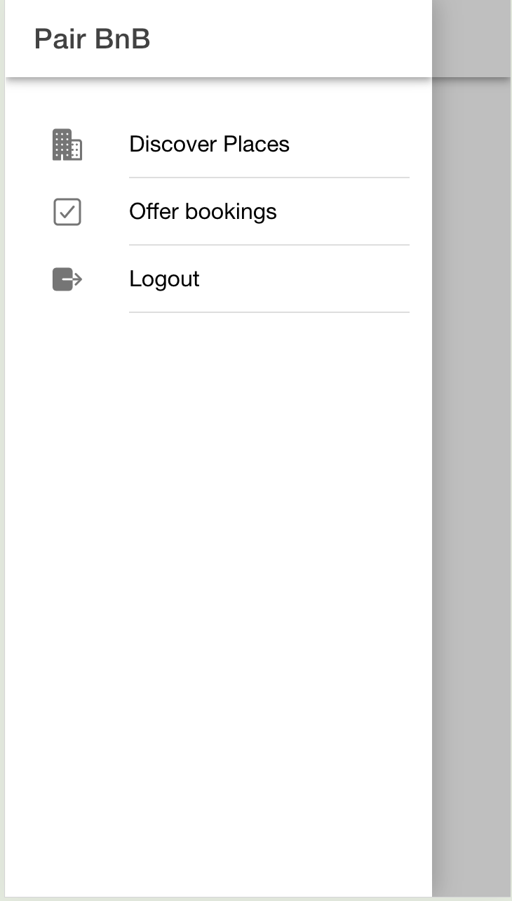
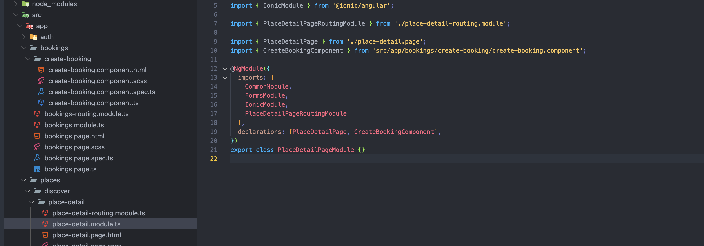

# Important Notes

## Common Facts

### ion-back
- ion-back button can be used on the pages wherever we want.
- The back button navigates back in the app's history when clicked. It is only displayed when there is history in the navigation stack, unless defaultHref is set.
- So while refreshing a page navigation stack will be empty and back button will not display on the page. To avoid this we can set defaultHref to show the place to go when stack is empty.

### Alert Controller
- Alert Controller can be created programatically like this.
- Alert control will take an object as input.

  

  

  ```typescript
  deletRecepe(){
    this.alertCntrl.create({header: 'Delete', message: 'Are you sure you want to delete this recipe?',
      buttons: [{text: 'Cancel', role: 'cancel'},
        {text: 'Delete', handler: () => {
          this.recipesService.deleteRecipe(this.loadedRecipe?.id);
          this.router.navigate(['/recipes']);
        }}
      ]
    }).then((alertEl) => alertEl.present());
    
  }
  ```

### Chrome Dev Tool
- Use the url **chrome://inspect/#devices** to debug native app using chrome with the help of emulator.

### Routing logic
- In ionic angular when we navigate from one page to another. Ionic will be pushing the last page in to cache memory.
- While we navigates back ionic will do pop and remove the current page from memory and navigates to previous page.
- Thus by using cache memory ionic speeds up loading of pages.
- The lifecycle methods are also different in ionic angular apps.
- While loading a new page angular method **ngOnit()** will be called. **ionViewWillEnter()**, **ionViewDidEnter()** methods are called from ionic. **ngOnDestroy** from angular is not callled in this scenario.
- **ngOnDestroy** is called when we pop from the stack. ie, coming back from the latest page, it will destroy latest page. Here previous page will be already present in the stack hence **ngOnInit** is not called here for that page.
- **ionViewWillLeave()** and **ionViewDidLeave()** are called always by ionic when leaves from a page.

### Hamberger Menu

- It can be add by using ionic element **ion-menu**.
- The menu element should be a sibling to the root content element. Normally sibling to **ion-router-outlet**.
- There can be any number of menus attached to the content. These can be controlled from the templates, or programmatically using the MenuController.
- We should specify **contentId** in ion-menu to render it as menu. This value should be equivalent to **id** of the sibling main content.
    

- Wherever we want to render the **menu** set the menu attribute value like this.
  

  


### Modal

#### Opening modal

- We can add modal to our ionic-angular application using ccomponents.
- Components can be loaded normally by using routing or component selector in the template. But here we are loading it programatically using **ModalController**.
- Add normal component(not page which uses lazy loading). We can design the template of the modal as normal component.
- We have to add component to **declarations** array of required module.
- If modal has been used in multiple module then kee it in shared modeule declarations array.

   

   

  Modal can be loaded programatically as shown below by injecting ModalController.

   

#### Closing Modal

- For closing the modal we can use a close button icon and while booking it will return the data and close the modal.
- For this we can use ModalController. This will provide dismiss method.
- The dismiss method will close top most modal. If we want to close specific modal then we have to use id.
- This dismiss method will take 3 parameter. First is the data we need want to return, 2nd is role for which we can give any value and 3rd is id where we can use it to close specific modal if multiple modals are present.
- While doing close we no need to pass any of these parameters.
- If we want to pass data to modal while creating it then we can pass componentProps to create
- If we want to specify id to modal then pass it as 3rd parameter to create method

  

  

  

