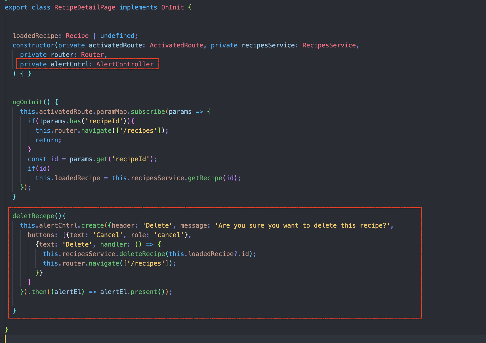

# Important Notes

## Common Facts

### ion-back
- ion-back button can be used on the pages wherever we want.
- The back button navigates back in the app's history when clicked. It is only displayed when there is history in the navigation stack, unless defaultHref is set.
- So while refreshing a page navigation stack will be empty and back button will not display on the page. To avoid this we can set defaultHref to show the place to go when stack is empty.

### Alert Controller
- Alert Controller can be created programatically like this.
- Alert control will take an object as input.

  

  

  ```typescript
  deletRecepe(){
    this.alertCntrl.create({header: 'Delete', message: 'Are you sure you want to delete this recipe?',
      buttons: [{text: 'Cancel', role: 'cancel'},
        {text: 'Delete', handler: () => {
          this.recipesService.deleteRecipe(this.loadedRecipe?.id);
          this.router.navigate(['/recipes']);
        }}
      ]
    }).then((alertEl) => alertEl.present());
    
  }
  ```

### Chrome Dev Tool
- Use the url **chrome://inspect/#devices** to debug native app using chrome with the help of emulator.
